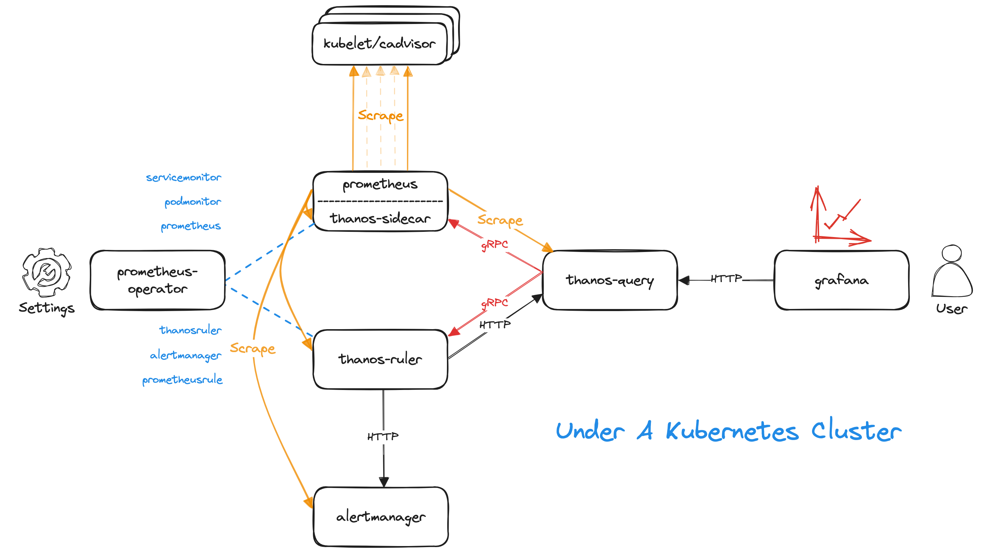

# Prombench

Benchmark for prometheus-thanos based monitoring systems.

* prometheus-operator
* alertmanager
* prometheus
* thanos-sidecar
* thanos-ruler
* thanos-query
* grafana
* generate-timeseries



Usage:

* Install CRDs

  ```
  make install-crds
  ```
* Install prombench cluster(s)

  ```
  # Deploy one prombench cluster in 'prombench' namespace.
  make install-prombench
  ```

  ```
  kubectl get pod,svc -n prombench

  # NAME                                       READY   STATUS    RESTARTS   AGE
  # pod/alertmanager-bench-0                   2/2     Running   0          30m
  # pod/alertmanager-bench-1                   2/2     Running   0          30m
  # pod/generate-timeseries-67cf47d4f4-kbztw   1/1     Running   0          30m
  # pod/generate-timeseries-67cf47d4f4-qxmkr   1/1     Running   0          30m
  # pod/generate-timeseries-67cf47d4f4-sf87l   1/1     Running   0          30m
  # pod/grafana-bench-58878c57c8-7whdh         1/1     Running   0          30m
  # pod/prometheus-bench-0                     3/3     Running   0          30m
  # pod/prometheus-bench-1                     3/3     Running   0          30m
  # pod/prometheus-operator-599f584487-pl6zj   1/1     Running   0          30m
  # pod/thanos-query-bench-779f68dff9-j9b5r    1/1     Running   0          30m
  # pod/thanos-query-bench-779f68dff9-tcpsp    1/1     Running   0          30m
  # pod/thanos-query-bench-779f68dff9-z2x26    1/1     Running   0          30m
  # pod/thanos-ruler-bench-0                   2/2     Running   0          30m
  # pod/thanos-ruler-bench-1                   2/2     Running   0          30m

  # NAME                            TYPE        CLUSTER-IP       EXTERNAL-IP   PORT(S)                           AGE
  # service/alertmanager            NodePort    10.222.208.52    <none>        9093:30465/TCP                    30m
  # service/alertmanager-operated   ClusterIP   None             <none>        9093/TCP,9094/TCP,9094/UDP        30m
  # service/grafana                 NodePort    10.222.187.117   <none>        3000:32721/TCP                    30m
  # service/prometheus              NodePort    10.222.205.18    <none>        9090:31440/TCP                    30m
  # service/prometheus-operated     ClusterIP   None             <none>        9090/TCP,10901/TCP                30m
  # service/prometheus-operator     ClusterIP   None             <none>        8080/TCP                          30m
  # service/thanos-query            NodePort    10.222.87.186    <none>        10901:32049/TCP,10902:32360/TCP   30m
  # service/thanos-ruler            NodePort    10.222.52.54     <none>        10902:32470/TCP                   30m
  # service/thanos-ruler-operated   ClusterIP   None             <none>        10902/TCP,10901/TCP               30m
  ```

  ```
  # PROMBENCH default value: prombench
  # Deploy two prombench clusters in 'prombench0' and 'prombench1' namespaces.
  make install-prombench PROMBENCH="prombench0 prombench1"
  ```
* Uninstall prombench cluster(s)

  ```
  # Clean up one prombench cluster in 'prombench' namespace.
  make uninstall-prombench

  # PROMBENCH default value: prombench
  # Clean up two prombench clusters in 'prombench0' and 'prombench1' namespaces.
  make uninstall-prombench PROMBENCH="prombench0 prombench1"
  ```
* Modify the replicas of generate-timeseries deployment

  ```
  # REPLICAS default value: 3
  make generator REPLICAS=6
  ```
* Modify the timeseries number of each generate-timeseries instance

  ```
  # NUMBER default value: 10000
  make timeseries NUMBER=20000
  ```
* Modify the scrape strategy generate-timeseries

  ```
  # INTERVAL default value: 30s
  # TIMEOUT default value: 29s
  make scrape INTERVAL=15s TIMEOUT=14s
  ```
* Modify the shards of prometheus

  ```
  # SHARDS default value: 1
  make prometheus SHARDS=2
  ```

References:

* [brian-brazil/benchmarks](https://github.com/brian-brazil/benchmarks)
* [VictoriaMetrics/prometheus-benchmark](https://github.com/VictoriaMetrics/prometheus-benchmark)
